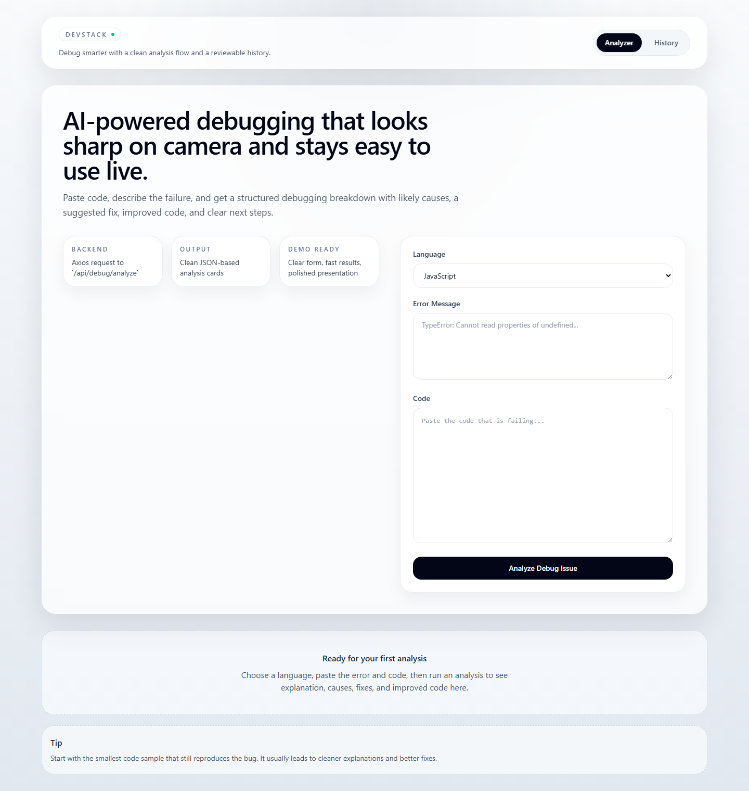
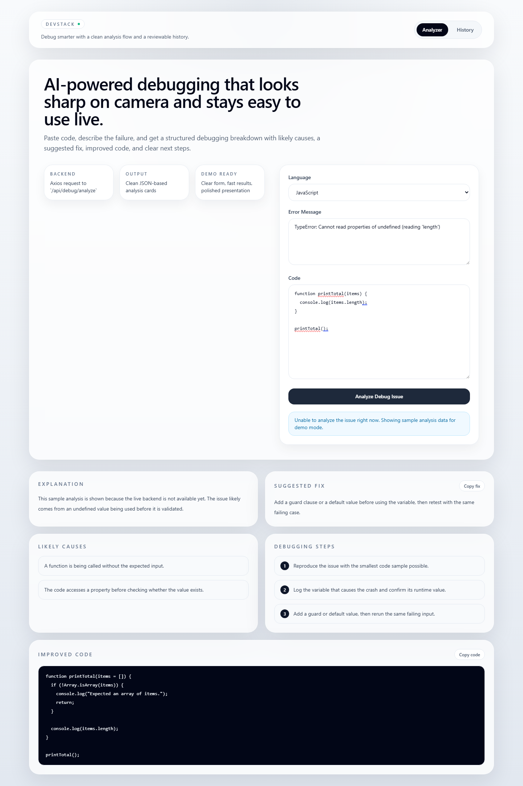
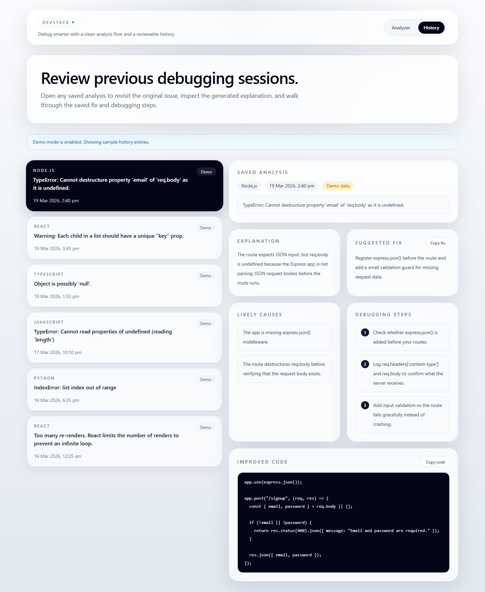

# 🚀 DevStack – AI-Powered Debugging Assistant

DevStack is an open-source, AI-powered debugging assistant designed to help developers quickly understand, fix, and improve their code. By combining structured analysis with AI-driven insights, DevStack reduces debugging time and makes problem-solving more accessible for developers of all skill levels.

---

## 🌍 Open Source Vision

DevStack is built with the goal of making debugging:
- **Faster** – reduce time spent searching for solutions  
- **Simpler** – explain errors in clear, human-friendly language  
- **Accessible** – support beginners and experienced developers alike  

This project is designed to grow with community contributions and evolve into a powerful developer productivity tool.

---

## 🧠 Problem Statement

Debugging is one of the most time-consuming and frustrating parts of software development.

Developers often:
- Jump between Stack Overflow, docs, and forums  
- Struggle to interpret cryptic error messages  
- Spend hours on trial-and-error fixes  

DevStack solves this by providing **instant, structured debugging insights** in a single interface.

---

## ✨ Features

- 🔍 Analyze code and error messages instantly  
- 📖 Clear, beginner-friendly explanations  
- 🧩 Root cause identification  
- 🛠️ Suggested fixes with improved code  
- 📋 Step-by-step debugging guidance  
- 🕘 Persistent history of past analyses  
- 🌐 Multi-language support (Python, JavaScript, etc.)  
- ⚡ Reliable fallback handling if AI response fails  

---

## 📸 Screenshots

### 🏠 Home Page


### 🔍 Debug Result


### 🕘 History Page


---

## 🧱 Tech Stack

**Frontend**
- React 19  
- Vite 7  
- Tailwind CSS 3  

**Backend**
- Node.js  
- Express 5  

**Database**
- MongoDB with Mongoose 8  

**AI Integration**
- Claude API  

**Other Tools**
- Axios  

---

## ⚙️ How It Works

1. User inputs:
   - Programming language  
   - Error message  
   - Code snippet  

2. Backend processes the request and sends it to the AI service  

3. AI returns structured debugging insights:
   - Explanation  
   - Causes  
   - Fix  
   - Improved code  
   - Debug steps  

4. Results are displayed in the UI and stored in MongoDB  

---

## 🤖 Why AI is Essential

DevStack leverages AI to:
- Interpret complex error messages  
- Translate them into simple explanations  
- Suggest precise fixes  
- Improve code quality  

This enables developers to debug faster and learn more effectively.

---

## 📁 Project Structure

```text
devstack/
|-- frontend/
|   |-- .env.example
|   |-- package.json
|   |-- src/
|   |   |-- components/
|   |   |-- lib/
|   |   `-- pages/
|   `-- vite.config.js
|-- backend/
|   |-- .env.example
|   |-- package.json
|   `-- src/
|       |-- config/
|       |-- controllers/
|       |-- middleware/
|       |-- models/
|       |-- routes/
|       |-- services/
|       `-- utils/
`-- README.md
```
---

## 🚀 Getting Started

### 1. Clone the repository

git clone https://github.com/Piyush-hacker/DevStack-AI-Debugging-Assistant.git
cd DevStack-AI-Debugging-Assistant

### 2. Install dependencies

Frontend:
cd frontend
npm install 

Backend:
cd backend  
npm install  

### 3. Setup environment variables

Create `.env` files using `.env.example` in both frontend and backend folders.

### 4. Run the project

Start backend:
cd backend  
npm run dev  

Start frontend (in another terminal):
cd frontend  
npm run dev  

Frontend: http://localhost:5173  
Backend: http://localhost:5000
